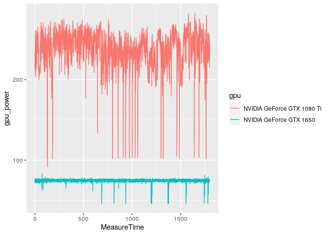
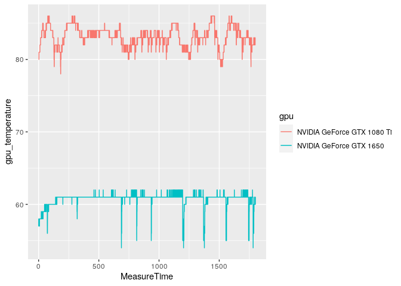

Assume someone, either a total nerd or a large custom PC building company, would like to keep track of the performance of the gaming PCs they build. In the company's case, this would help ensure performance between systems featuring the same components perform consistently, so they could avoid shipping out malfunctioning systems. In the nerd's case, it would bring up the pride of having massively overengineered the solution to a non-problem.

[CapFrameX](https://github.com/CXWorld/CapFrameX) is open-source software for Microsoft Windows that can track gaming performance, frames per second (FPS) and frame time, and component sensor data like CPU temperature and graphics card power consumption. When a game is running, CapFrameX can display this data, but it can also save it to a JSON file.


Logging every single frame time, of course, will generate a vast amount of data. The screenshot shows that the current frame took 7.2ms to render, which means we are generating around 150 data points per second, and we want to log all of them. So if we capture 30 minutes of gameplay data, we'll have approximately 300,000 data points.

Our first step is extracting the data from the JSON files and then loading the data into an appropriate table structure in a GridDB database.

## Extracting CapFrameX data from JSON


```r
# The data and entire project is available for download at: 
# https://github.com/retowyss/pc-benchmarking-r-griddb

library(tidyverse)
library(jsonlite)

# This is just some janitorial data wrangling
# The function reads the data captured by CapFrameX and makes it available
# in a easy to use format.
# Returns a list of three things: system-info, capture-data, sensor-data
read_capframex_json <- function(x) {
  capframe_data <- read_json(x, simplifyVector = TRUE)
  
  # We need a common length for the captured sensor data because some rows
  # are length n and some are n-k 
  common_n <- length(capframe_data$Runs$SensorData2$MeasureTime$Values[[1]])
  
  list(
    info    = capframe_data$Info %>% 
      keep(~!is.null(.)) %>% 
      as_tibble(),
    capture = as_tibble(map(capframe_data$Runs$CaptureData, ~ .[[1]])),
    sensors = imap_dfc(capframe_data$Runs$SensorData2, function(df, names) {
      
      m <- length(df$Values[[1]])
      vals <- vector(mode = typeof(df$Values[[1]]), common_n)
      
      # if vector is shorter, we fill last value
      if(m < common_n) {
        vals <- c(df$Values[[1]], rep(df$Values[[1]][m], common_n - m))
      } else {
        vals <- (df$Value[[1]])[1:common_n]
      }
      
      res <- list()
      # Some list names are not appropriate as tibble headers
      n <- str_remove(str_replace_all(names, "/", "_"), "_")
      res[[n]] <- vals
      
      as_tibble(res)
    })
  )
}

capframex_data <- read_capframex_json("data/CapFrameX-DOOMEternalx64vk.exe-2.json")
```

For our purposes, we keep as little data as necessary, but there's a lot more;
feel free to explore. 

The capture data creates one data point per frame (`MsBetweenPresents`), 
which means that the number of rows we end up with when capturing in a fixed time 
window is variable. However, the sensor data is polled in a relatively fixed 
interval (`BetweenMeasureTime`) of 250ms, although we can see that there is 
some variation.


```r
capframex_data$info %>% 
  select(Processor, GPU, SystemRam, GameName, OS, Motherboard) %>% 
  knitr::kable()
```


|Processor         |GPU                        |SystemRam             |GameName     |OS                                   |Motherboard                                     |
|:-----------------|:--------------------------|:---------------------|:------------|:------------------------------------|:-----------------------------------------------|
|AMD Ryzen 9 5900X |NVIDIA GeForce GTX 1080 Ti |16GB (2x8GB) 3200MT/s |Doom Eternal |Microsoft Windows 11 Pro Build 22000 |Gigabyte Technology Co. Ltd. B550I AORUS PRO AX |

The info table contains the PC system hardware (Processor, GPU, RAM, Motherboard) 
and software data (Game, Operating System).


```r
capframex_data$capture %>% 
  select(TimeInSeconds, MsBetweenPresents) %>% 
  head(n = 3) %>% 
  knitr::kable()
```


| TimeInSeconds| MsBetweenPresents|
|-------------:|-----------------:|
|     0.0000000|            8.2026|
|     0.0058994|            5.8994|
|     0.0142062|            8.3068|

The capture tables contains performance data. The first frame recorded at 
time = 0 (`TimeInSeconds`) took 8.2ms (`MsBetweenPresents`) for the hardware to 
render. The second frame took 5.9ms (`MsBetweenPresents`), so relative to the start of the session 
0.0059 (`TimeInSeconds`) seconds had passed.

We call this performance data because better hardware uses less time per 
frame, which means it produces more frames per second (FPS) and therefore 
the animations in game look smoother. But perceived smoothness is not only a 
factor of the number of frames the hardware can render, but also affected by 
the variation in frame to frame time; less variation is better. So, recurring
large excursions in frame times can be an indicator of performance problems even
if the average frame times are good (low).

* `TimeInSeconds`: Time in seconds since the session was started
* `MsBetweenPresents`: Time it took to render current frame, essentially `TimeInSeconds` (n) - `TimeInSeconds`(n - 1)


```r
capframex_data$sensors %>% 
  select(MeasureTime, BetweenMeasureTime,
   cpu_power = amdcpu_0_power_0,
   cpu_temperature = amdcpu_0_temperature_0,
   gpu_clock = nvidiagpu_0_clock_0, 
   gpu_power = nvidiagpu_0_power_0, 
   gpu_temperature = nvidiagpu_0_temperature_0
  ) %>% 
  head(n = 2) %>% 
  knitr::kable()
```


| MeasureTime| BetweenMeasureTime| cpu_power| cpu_temperature| gpu_clock| gpu_power| gpu_temperature|
|-----------:|------------------:|---------:|---------------:|---------:|---------:|---------------:|
|       0.004|              0.004|  106.7973|          61.750|    1961.5|   234.502|              80|
|       0.265|              0.261|  108.1045|          61.625|    1961.5|   211.884|              80|

The sensor data's `MeasureTime` is like the capture data's `TimeInSeconds`; it tells the time since the session start. However, because the sensor data is polled in fixed intervals and not when a 
new frame is generated, so the data-points don't related one-to-one.

* `MeasureTime`: Time in seconds since the session was started
* `BetweenMeasureTime`: exact time since previous measurement (approximately 250ms)
* `cpu_power`: The CPU (processor) power consumption in Watts
* `cpu_temperature`: The CPU temperature in degrees 
* `gpu_clock`: The GPU (graphics card) clock speed in MHz
* `gpu_power`: The GPU power consumption in Watts
* `gpu_temperature`: The GPU temperature


## Loading CapFrameX data into GridDB

We create three tables (Info, Capture, and Sensor) in our 
[GridDB](docs.griddb.net ) and the we build an insert function to populate the 
tables with a json file. In the Process we also need to add ids to properly 
reference our relational data points.


```r
# We are using a docker based setup that can run this project ootb
# it's available here: https://github.com/retowyss/rstudio-server-griddb-docker

# You can set this up without docker, the containers use:

# Latest version griddb                 https://docs.griddb.net
# Latest version of R and tidyverse     R >= 4.0.0
# Latest version of JDBC                https://github.com/griddb/jdbc

# For general setup without docker you can follow this post:
# https://griddb.net/en/blog/analyzing-nba-play-by-play-data-using-r-and-griddb/

library(RJDBC)
drv <- JDBC(
  driverClass = "com.toshiba.mwcloud.gs.sql.Driver",
  # Point this to your gridstore jar
  classPath = "/jdbc/bin/gridstore-jdbc.jar"
)

# IP and port depend on your setup
griddb <- dbConnect(
  drv, 
  "jdbc:gs://172.20.0.42:20001/dockerGridDB/public", 
  "admin", 
  "admin"
)

# System info table: cfx_info
dbSendUpdate(griddb, paste(
  "CREATE TABLE IF NOT EXISTS cfx_info", 
  "(id INTEGER, Processor STRING, GPU STRING, SystemRam STRING,", 
  "GameName STRING, OS STRING, Motherboard STRING);"
))

# Frame time capture data: cfx_capture
dbSendUpdate(griddb, paste(
  "CREATE TABLE IF NOT EXISTS cfx_capture", 
  "(info_id INTEGER, TimeInSeconds FLOAT, MsBetweenPresents FLOAT);"
))

# Sensor data: cfx_sensors
dbSendUpdate(griddb, paste(
  "CREATE TABLE IF NOT EXISTS cfx_sensors", 
  "(info_id INTEGER, MeasureTime FLOAT, BetweenMeasureTime FLOAT,", 
  "cpu_power FLOAT, cpu_temperature FLOAT, gpu_clock FLOAT, gpu_power FLOAT,", 
  "gpu_temperature FLOAT);"
))

dbInsertTable <- function(conn, name, df, append = TRUE) {
  for (i in seq_len(nrow(df))) {
    dbWriteTable(conn, name, df[i, ], append = append)
  }
  invisible(TRUE)
}

# This is not a "production" ready approach of doing this, but it's sufficient
# for this demo :)
# Inserts dataset (cfx_data) into database (conn) using ID (uid)
insert_cfx_data <- function(conn, cfx_data, uid) {
  
  dbInsertTable(conn, "cfx_info", 
    cfx_data$info %>% 
      transmute(id = uid, Processor, GPU, SystemRam, GameName, OS, Motherboard)
  )
  
  dbInsertTable(conn, "cfx_capture", 
    cfx_data$capture %>% 
      transmute(info_id = uid, TimeInSeconds, MsBetweenPresents)
  )
  
  dbInsertTable(conn, "cfx_sensors",
    cfx_data$sensors %>% 
      transmute(
        info_id = uid, 
        MeasureTime, 
        BetweenMeasureTime,
        cpu_power = amdcpu_0_power_0,
        cpu_temperature = amdcpu_0_temperature_0,
        gpu_clock = nvidiagpu_0_clock_0, 
        gpu_power = nvidiagpu_0_power_0, 
        gpu_temperature = nvidiagpu_0_temperature_0
      )            
  )
  invisible(TRUE)
}
```


```r
# Insert (this takes a while, don't run while knitting the doc)
json_files <- list.files("data")
walk2(json_files, 1:length(json_files), function(x, i) {
  insert_cfx_data(griddb, read_capframex_json(paste0("data/", x)), i)
})
```

I collected the data using a single system (Ryzen 9 5900X, 16GB RAM, Windows 11),
but I tested multiple games and I tested two different graphics cards (GPU);
the GTX 1650 and GTX 1080 Ti. 


```r
# Check
dbGetQuery(griddb,"SELECT * FROM cfx_info;") %>% 
  knitr::kable()
```


| id|Processor         |GPU                        |SystemRam             |GameName                  |OS                                   |Motherboard                                     |
|--:|:-----------------|:--------------------------|:---------------------|:-------------------------|:------------------------------------|:-----------------------------------------------|
|  1|AMD Ryzen 9 5900X |NVIDIA GeForce GTX 1080 Ti |16GB (2x8GB) 3200MT/s |Assassin's Creed Valhalla |Microsoft Windows 11 Pro Build 22000 |Gigabyte Technology Co. Ltd. B550I AORUS PRO AX |
|  2|AMD Ryzen 9 5900X |NVIDIA GeForce GTX 1650    |16GB (2x8GB) 3200MT/s |Cyberpunk 2077            |Microsoft Windows 11 Pro Build 22000 |Gigabyte Technology Co. Ltd. B550I AORUS PRO AX |
|  3|AMD Ryzen 9 5900X |NVIDIA GeForce GTX 1650    |16GB (2x8GB) 3200MT/s |Doom Eternal              |Microsoft Windows 11 Pro Build 22000 |Gigabyte Technology Co. Ltd. B550I AORUS PRO AX |
|  4|AMD Ryzen 9 5900X |NVIDIA GeForce GTX 1080 Ti |16GB (2x8GB) 3200MT/s |Doom Eternal              |Microsoft Windows 11 Pro Build 22000 |Gigabyte Technology Co. Ltd. B550I AORUS PRO AX |
|  5|AMD Ryzen 9 5900X |NVIDIA GeForce GTX 1650    |16GB (2x8GB) 3200MT/s |ROLLERDROME               |Microsoft Windows 11 Pro Build 22000 |Gigabyte Technology Co. Ltd. B550I AORUS PRO AX |

We only put a few files into the GridDB database, but already have almost 800,000 rows of capture data. 


```r
# Check
dbGetQuery(griddb,"SELECT COUNT(*) FROM cfx_capture;")
```

```
##         
## 1 778780
```

## Creating PC Performance Summaries

We now want performance summaries for specific CPU, GPU, and game combinations. The PC building company could expand on that idea and compare data to a different system using the same hardware components. This way, they could ensure the newly built system performs within expectations before delivering it to the customer.


```r
# We use paste and str_interp to build up our SQL in a readable and easy to
# understand way
get_performance_summary <- function(conn, cpu, gpu, game) {
  system_info <- paste(
    "SELECT ID",
    "FROM cfx_info",
    "WHERE Processor = '${cpu}' AND GPU = '${gpu}' AND GameName = '${game}'"
  )
  
  capture <- paste(
    "SELECT AVG(MsBetweenPresents) AS frame_time,",
    "MAX(TimeInSeconds) AS session_time,",
    "COUNT(*) AS frame_count",
    "FROM (", system_info, ") info",
    "LEFT JOIN (SELECT * FROM cfx_capture) capture",
    "ON info.id = capture.info_id"
  )

  sensors <-paste(
    "SELECT AVG(cpu_power) AS cpu_power, ",
    "AVG(cpu_temperature) AS cpu_temperature,",
    "AVG(gpu_clock) AS gpu_clock, AVG(gpu_power) AS gpu_power,",
    "AVG(gpu_temperature) AS gpu_temperature",
    "FROM (", system_info, ") info",
    "LEFT JOIN (SELECT * FROM cfx_sensors) sensors",
    "ON info.id = sensors.info_id"
  )
  
  capture_res <- dbGetQuery(conn, str_interp(capture))
  sensors_res <- dbGetQuery(conn, str_interp(sensors))
  
  as_tibble(bind_cols(
    tibble(cpu = cpu, gpu = gpu, game = game),
    capture_res %>% 
      mutate(fps = 1000 / frame_time), 
    sensors_res
  ))
}

gtx_1650_rollerdrome <- get_performance_summary(griddb, 
  cpu =  "AMD Ryzen 9 5900X", 
  gpu =  "NVIDIA GeForce GTX 1650", 
  game = "ROLLERDROME"
)

glimpse(gtx_1650_rollerdrome)
```

```
## Rows: 1
## Columns: 12
## $ cpu             <chr> "AMD Ryzen 9 5900X"
## $ gpu             <chr> "NVIDIA GeForce GTX 1650"
## $ game            <chr> "ROLLERDROME"
## $ frame_time      <dbl> 2.660829
## $ session_time    <dbl> 400.8515
## $ frame_count     <dbl> 150650
## $ fps             <dbl> 375.8227
## $ cpu_power       <dbl> 95.65372
## $ cpu_temperature <dbl> 56.58357
## $ gpu_clock       <dbl> 1848.533
## $ gpu_power       <dbl> 74.72834
## $ gpu_temperature <dbl> 60.41905
```

We can also turn that into a text paragraph that could be included in a system report.


```r
summary2text <- function(summary_data) {
  spinable <-paste0(
    "Your system featuring a ${cpu} and ${gpu} performance in ", 
    "a ${round(session_time/60)} minutes session of ${game} ",
    "was ${round(fps)} FPS.",
    "The graphics card used ${round(gpu_power)}W and ",
    "ran at ${round(gpu_temperature)}°C, ",
    "while the CPU used ${round(cpu_power)}W and ", 
    "ran at ${round(cpu_temperature)}°C"
  )
  
  str_interp(spinable, env = summary_data)
}

summary2text(gtx_1650_rollerdrome)
```

```
## [1] "Your system featuring a AMD Ryzen 9 5900X and NVIDIA GeForce GTX 1650 performance in a 7 minutes session of ROLLERDROME was 376 FPS.The graphics card used 75W and ran at 60°C, while the CPU used 96W and ran at 57°C"
```

## Temporal Analysis

We can do a lot of computations, like calculating summaries, directly on the database, 
but sometimes we have to pull data out of the database so we can analyse it in detail.

When a device uses more power, its temperature should rise. So, what we should 
find is that gpu_power correlates with gpu_temperature.


```r
get_sensor_data <- function(conn, cpu, gpu, game) {
  system_info <- paste(
    "SELECT ID",
    "FROM cfx_info",
    "WHERE Processor = '${cpu}' AND GPU = '${gpu}' AND GameName = '${game}'"
  )

  sensors <-paste(
    "SELECT *",
    "FROM (", system_info, ") info",
    "LEFT JOIN (SELECT * FROM cfx_sensors) sensors",
    "ON info.id = sensors.info_id"
  )

  sensors_res <- dbGetQuery(conn, str_interp(sensors))
  
  cbind(tibble(cpu = cpu, gpu = gpu, game = game), as_tibble(sensors_res))
}

gtx_1080_ti_doom <- get_sensor_data(griddb, 
  cpu =  "AMD Ryzen 9 5900X", 
  gpu =  "NVIDIA GeForce GTX 1080 Ti", 
  game = "Doom Eternal"                                  
) 

gtx_1650_doom <- get_sensor_data(griddb, 
  cpu =  "AMD Ryzen 9 5900X", 
  gpu =  "NVIDIA GeForce GTX 1650", 
  game = "Doom Eternal"                                  
) 

doom_data <- bind_rows(gtx_1080_ti_doom, gtx_1650_doom)

ggplot(doom_data, aes(x = MeasureTime, y = gpu_power, color = gpu)) +
  geom_line()
```

<!-- -->

The sudden drops in power are interesting; but they are not erroneous. They
correspond to loading checkpoints, falling down cliffs, loading cinematics, etc.
The graphics card doesn't have to work hard during those brief moments, so it
doesn't need as much juice.


```r
ggplot(doom_data, aes(x = MeasureTime, y = gpu_temperature, color = gpu)) +
  geom_line()
```

<!-- -->

The GTX 1650, which is the less powerful card, shows greater drops in temperature
that correspond to checkpoint loading. This is likely because the thermal capacity
of the heat sink is lower and it cools down much more quickly than the heft junk
of aluminum on the GTX 1080 Ti.


```r
# Technically there may be a small delay until the gpu-die heats up and
# the current temperature of the heatsink may also affect the gpu temperature 
cor.test(gtx_1080_ti_doom$gpu_power, gtx_1080_ti_doom$gpu_temperature)
```

```
## 
## 	Pearson's product-moment correlation
## 
## data:  gtx_1080_ti_doom$gpu_power and gtx_1080_ti_doom$gpu_temperature
## t = 48.622, df = 7071, p-value < 2.2e-16
## alternative hypothesis: true correlation is not equal to 0
## 95 percent confidence interval:
##  0.4828882 0.5178252
## sample estimates:
##       cor 
## 0.5005605
```

And, we find that correlation.

## Summary

* We've seen how we can extract the JSON saved by CapFrameX using R.
* We created a table schema in GridDB and inserted the data from the JSON files.
* We used `paste` and `str_interp` to build parameterized queries in R against GridDB.
* We used window functions on GridDB so we can avoid loading data onto our workstation.
* We pulled data out of GridDB to analyze it in R.

If you'd like to use your own data you may have to adjust some parts of the data
extraction process. Here we specifically grab "amd_cpu" and "nvidia_gpu", so if 
you have a different combination you have to rename some selectors, or make it
work for any combination; and then share it on Github :)


